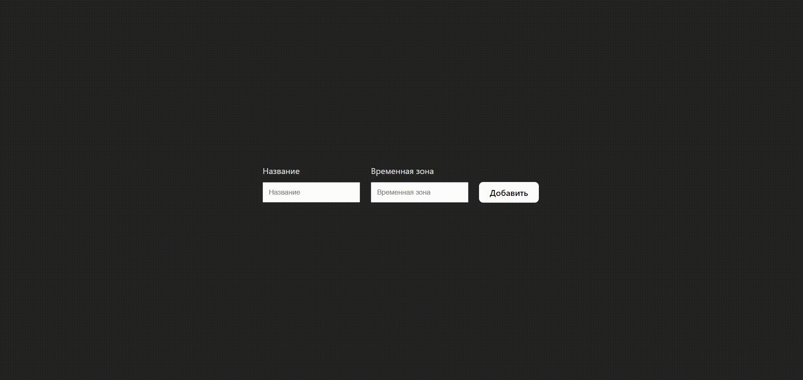

# world-clocks
### Ссылка на прототип:

https://vobiryukov12.github.io/world-clocks/

## Preview

## Описание
Мини-приложение на React, показывающие время в разных столицах мира.

### Возможности приложения:
- Чтобы добавить часы нужно указать название города и временную зону (смещение в часах относительно UTC)
- При нажатии на крестик часы автоматически удаляются

### Особенности проекта:
- Все часы тикают в реальном времени, то есть отсчитываются секунды, минуты и часы
- Используется библиотека moment.js

### Технологии используемые на проекте:

